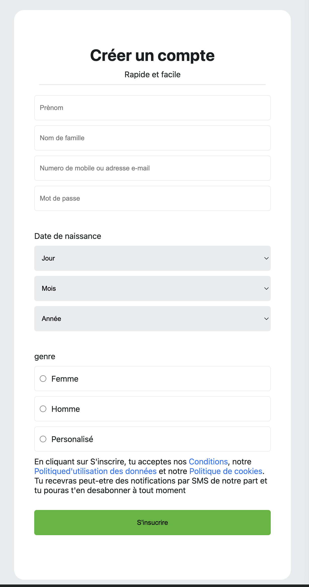
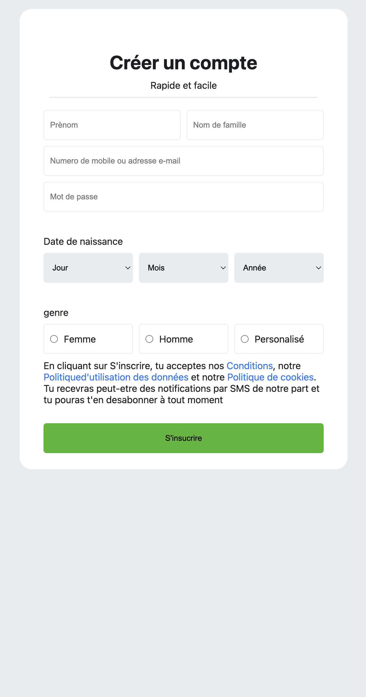

# Facebook SignUp Page
Ce projet consiste à réaliser une page d'inscription inspirée de Facebook en utilisant uniquement HTML et CSS. L'objectif est de reproduire l'interface utilisateur de la page d'inscription de Facebook, en mettant l'accent sur la structure sémantique, l'accessibilité et le design responsive.

Structuration du formulaire d'inscription avec des champs pour le prénom, le nom, l'email ou le numéro de téléphone, le mot de passe, la date de naissance et le genre.
Respect des bonnes pratiques d'accessibilité (labels, aria-labels, etc.).
Utilisation de styles CSS pour obtenir une interface moderne et agréable à utiliser.
Adaptation de la page pour différents supports (ordinateurs, tablettes, mobiles).
Ajout d'informations légales et de liens vers les conditions d'utilisation, la politique de confidentialité et la politique de cookies.
Ce projet permet de s'entraîner à l'intégration web et de se familiariser avec la création de formulaires complexes et accessibles.

### lien de la page github-page : [Cliquez ici](https://epiphane-code.github.io/Facebook-SignUp/)

# Objectifs
 ["Reproduire une interface réaliste","Maîtriser HTML & CSS","Travailler l’accessibilité","Comprendre la logique des formulaires","Adapter le design au responsive","Développer l’attention au détail","Préparer à l’intégration front-end"]

# L'appercue des images :
## petit ecran:

# grand ecran :
